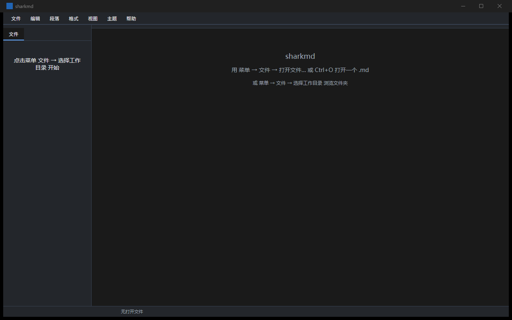

# sharkmd

> 一款对标 Typora 体验的本地 Markdown 编辑器。基于 Tauri 2 + React 18 + TipTap 2 + unified/remark，所见即所得，本地优先，支持 Windows（macOS/Linux 代码兼容）。

  

---

## ✨ 特性

### 核心编辑
- **所见即所得渲染** —— CommonMark + GFM（表格、删除线、任务列表、围栏代码）
- **Typora 式即时渲染** —— 键入 `# 空格` 立即变 H1、`**粗体**` 自动格式化
- **完整快捷键** —— Ctrl+B/I/K 加粗/斜体/链接、Ctrl+Z/Y 撤销重做、Ctrl+F 查找替换、Ctrl+1/2/3 标题级别
- **工具栏** —— H1/H2/H3、列表、引用、代码块、链接、图片、3×3 表格、分割线
- **粘贴 Markdown 自动格式化**
- **拖拽 / 粘贴图片自动保存到 `<fileDir>/assets/`**

### 文件管理
- **多标签页** —— 同时打开多个文件，标签可关闭
- **文件树** —— 递归展开/折叠的目录树，懒加载
- **侧栏双 tab** —— 文件 / 大纲（点击大纲项跳转到对应 heading）
- **新建 .md** —— 一键创建
- **Ctrl+O 打开** —— 原生文件选择器
- **记住工作目录** —— 重启自动恢复

### 数据安全
- **自动保存** —— 编辑后 300ms 静默写盘，tab 显示脏标记
- **崩溃恢复** —— 异常退出后启动弹"未保存的会话"对话框
- **原子写** —— 写盘先写 `.tmp` 再 rename，避免写一半崩溃损坏源文件
- **外部修改检测** —— 别的程序改了你的文件，弹窗问"加载外部版 / 保留我的"

### 编辑器增强
- **查找 / 替换** —— Ctrl+F 打开，Enter 跳下一个，Esc 关闭
- **行/列位置** —— 底部状态栏实时显示光标 Ln N, Col M
- **字数统计** —— 实时显示词数 / 字符数
- **主题切换** —— 浅色 / 深色
- **自动滚动** —— 切 tab 时活动 tab 自动滚到可见
- **保存状态指示** —— 顶部 `● 未保存` / `✓ 已自动保存`

---

## 📸 截图

### 主界面（深色主题、菜单栏 + 侧栏 + 状态栏）



*首次启动后：左侧"文件"tab + 提示选择工作目录；中央欢迎页；底部状态栏。*

### 布局说明

```
┌─ 菜单栏 (文件 / 编辑 / 段落 / 格式 / 视图 / 主题 / 帮助) ──────────┐
├─ Tabs: [123.md] [456.md●] [data.md] ─────────────────────────────┤
├─ 文件/大纲 ─┬─ 工具栏 ─────────────────────────────────────────┤
│  ▼ docs      │  H1 H2 H3 | B I S </> | • 列表 1. 列表 " 引用 |  │
│    ▼ proj    │  🔗 — 分割 | ⊞ 表格 ``` 代码 🖼 图片              │
│      a.md    │  ────────────────────────────────────────────────  │
│    b.md      │  # Welcome to sharkmd                              │
│  plugins/    │                                                    │
│  satinfo/    │  **bold** _italic_ ~~strike~~ `inline code`        │
│              │                                                    │
│              │  - bullet                                          │
│              │  1. ordered                                       │
│              │                                                    │
├──────────────┴─ 状态栏 ──────────────────────────────────────────┤
│ ✓ 已自动保存 | D:\docs\a.md | 1 词 · 12 字符 | P Ln 1, Col 6 | UTF-8 │
└──────────────────────────────────────────────────────────────────┘
```

### 各 UI 元素

| 区域 | 元素 | 说明 |
|------|------|------|
| **菜单栏** | 文件 / 编辑 / 段落 / 格式 / 视图 / 主题 / 帮助 | 7 个下拉菜单，几乎所有操作都可达 |
| **标签栏** | 打开的文件 tabs | 当前活动 tab 加粗 + 蓝色下划线 + 自动滚到可见 |
| **侧栏** | 文件 tab + 大纲 tab | 切换 tab 显示 FileTree 或 Outline（从当前文档抽 heading） |
| **工具栏** | H1/H2/H3 · B/I/S · 列表 · 引用 · 链接 · 分割 · 表格 · 代码 · 图片 | 一键插入 Markdown 元素 |
| **编辑器** | WYSIWYG | 键入即渲染，无预览/编辑模式切换 |
| **状态栏** | 保存状态 · 路径 · 词数/字符数 · Ln/Col · 块类型 · 编码 | 实时显示光标位置 |
| **查找条** | Ctrl+F | 顶部弹出，Enter 跳下一个匹配 |

### 与同类的对比

| 特性 | sharkmd | Typora | Obsidian | Mark Text | VSCode |
|------|:---:|:---:|:---:|:---:|:---:|
| 所见即所得 | ✅ | ✅ | ⚠️ 预览 | ✅ | ❌ 双栏 |
| 本地优先 / 离线 | ✅ | ✅ | ✅ | ✅ | ✅ |
| 多标签 / 多文件 | ✅ | ⚠️ 单文档 | ✅ | ⚠️ | ✅ |
| 侧栏文件树 | ✅ | ✅ | ✅ | ❌ | ✅ |
| 文档大纲跳转 | ✅ | ✅ | ✅ | ❌ | ✅ |
| 实时渲染（边输边格式化） | ✅ | ✅ | ❌ | ✅ | ❌ |
| 自动保存 | ✅ | ✅ | ⚠️ | ✅ | ✅ |
| 外部修改检测 | ✅ | ✅ | ⚠️ | ❌ | ✅ |
| 崩溃恢复 | ✅ | ⚠️ | ⚠️ | ❌ | ⚠️ |
| 多端（Win/macOS/Linux） | 🔜 | ✅ | ✅ | ✅ | ✅ |
| 插件系统 | 🔜 v1.0 | ⚠️ 第三方 | ✅ | ❌ | ✅ |
| 同步到云 | 🔜 v1.0 | ⚠️ iCloud | ✅ Obsidian Sync | ❌ | ⚠️ |
| KaTeX 数学 | 🔜 v0.2 | ✅ | ✅ | ❌ | ✅ |
| Mermaid 图表 | 🔜 v0.2 | ✅ | ✅ | ❌ | ✅ |
| 价格 | 免费 + MIT | $15 一次性 | 免费（同步付费） | 免费 + MIT | 免费 |

---

## 🚀 快速开始

### 环境要求

| 工具 | 版本 | 说明 |
|---|---|---|
| Node.js | ≥ 20.10 | pnpm 8 兼容 |
| pnpm | 8.x | 包管理器 |
| Rust | ≥ 1.75 | Tauri 2 后端 |
| WebView2 | 最新 | Windows 自带/Edge 安装 |
| MSVC Build Tools | 最新 | Windows Rust 编译 |

### 安装与运行

```bash
# 1. 克隆
git clone https://github.com/kujirashark/sharkmd.git
cd sharkmd

# 2. 安装依赖
pnpm install

# 3. 启动开发模式（热重载）
pnpm tauri dev

# 4. 打包发布版（Windows MSI / NSIS）
pnpm tauri build
```

首次启动会编译 Rust 依赖（2-3 分钟）。增量编译 5-15 秒。

---

## 🧪 测试

```bash
pnpm test              # 跑 45 个 Vitest 单元测试
pnpm test:watch        # 监听模式
pnpm test:coverage     # 生成 coverage 报告（html/）
pnpm test:e2e          # Playwright E2E（需 tauri-driver）
```

### 测试覆盖

- **编辑器桥接** —— 9 个 roundtrip + 5 个 mdast→tiptap + 4 个 tiptap→mdast = **18 个 roundtrip 黄金测试**，覆盖所有 MVP Markdown 语法
- **输入规则** —— 8 个测试覆盖每条 `# `、`**`、`` ` ``、`[` 等规则
- **粘贴检测** —— 2 个测试覆盖 Markdown 粘贴检测
- **Rust 后端** —— 6 个 cargo test 覆盖 fs/draft/settings/外部修改监听
- **UI 状态** —— tabs / theme / autosave / recovery / file tree 各组件

---

## 🏗 架构

### 总体

```
┌─────────────────────────────────────────┐
│  Tauri 2 (Rust)                          │
│   ├─ commands/fs (open/save/save_as/...)  │
│   ├─ commands/draft (崩溃恢复)            │
│   ├─ commands/settings (主题/上次目录)    │
│   └─ watch (notify crate, 外部修改监听)  │
└──────────────────┬──────────────────────┘
                   │ Tauri IPC (typed)
┌──────────────────▼──────────────────────┐
│  React 18 + TypeScript                   │
│   ├─ editor/  (TipTap + 桥接 + 扩展)     │
│   ├─ tabs/    (Zustand 状态)              │
│   ├─ sidebar/ (文件树 + 大纲)            │
│   ├─ theme/   (CSS 变量)                │
│   ├─ assets/  (图片粘贴)                │
│   ├─ autosave/(300ms debounce)           │
│   └─ app/     (AppShell + MenuBar +     │
│                StatusBar + FindBar)      │
└─────────────────────────────────────────┘
```

### 数据流（打开 .md）

```
FileTree click "a.md"
  → AppLayout.openFileByPath(path)
    → tauri.openFile(path)        [Rust: 读 + UTF-8 + mtime]
      → parseMarkdown(text)      [unified + remark-gfm → TipTap JSON]
        → addTab({content: json, ...})  [Zustand: tabs + activeId]
          → Editor receives new value
            → useEditor setContent(json, false)
              → ProseMirror renders
              → onUpdate → autosave.schedule(tabId)
```

### 桥接（核心）

```
.md 文件  ──[unified + remark-parse + remark-gfm]──>  MDAST (AST)
         ──[mdastToTiptap (bridge/mdast-to-tiptap)]─>  TipTap JSON
         ──[tiptapToMdast (bridge/tiptap-to-mdast)]─>  MDAST
         ──[unified + remark-stringify]─────────────>  .md 字符串
```

**保证**：`parse → serialize` 9 个黄金 fixture 完整 roundtrip。

---

## 📁 目录结构

```
sharkmd/
├─ src/                          # React 前端
│  ├─ app/                       # 应用壳
│  │  ├─ App.tsx                 # 根组件，注入 test hook
│  │  ├─ AppLayout.tsx           # 三栏布局：侧栏 + 编辑器 + 状态栏
│  │  ├─ MenuBar.tsx             # 7 菜单
│  │  ├─ SidebarTabs.tsx         # 文件/大纲 tab
│  │  └─ StatusBar.tsx           # 底部状态栏
│  ├─ editor/                    # 编辑器核心
│  │  ├─ Editor.tsx              # React wrapper
│  │  ├─ Toolbar.tsx             # 格式工具栏
│  │  ├─ FindBar.tsx             # 查找替换
│  │  ├─ schema/                 # ProseMirror schema (16 nodes + 5 marks)
│  │  ├─ bridge/                 # MDAST ↔ TipTap 双向桥接
│  │  └─ extensions/             # 输入规则、粘贴、快捷键
│  ├─ tabs/                      # 多标签 store
│  ├─ sidebar/                   # 文件树 + 大纲
│  ├─ theme/                     # 主题 CSS
│  ├─ assets/                    # 图片处理
│  ├─ autosave/                  # 300ms debounce 自动保存
│  ├─ crash-recovery/            # 崩溃恢复对话框
│  ├─ tauri/                     # IPC 客户端
│  └─ utils/                     # 工具（hashPath, etc.）
├─ src-tauri/                    # Rust 后端
│  ├─ src/
│  │  ├─ main.rs                 # 入口
│  │  ├─ lib.rs                  # 注册 Tauri 命令
│  │  ├─ error.rs                # AppError 类型
│  │  ├─ log_setup.rs            # 日志
│  │  └─ commands/
│  │     ├─ fs.rs                # open/save/save_as/read_dir/watch/save_asset
│  │     ├─ draft.rs             # save/list/delete draft
│  │     └─ settings.rs          # get/set settings
│  ├─ tests/                     # 6 个 cargo 集成测试
│  ├─ capabilities/
│  │  └─ default.json            # Tauri 2 permissions
│  ├─ Cargo.toml
│  └─ tauri.conf.json
├─ tests/
│  └─ e2e/                       # Playwright (forward-looking)
├─ docs/
│  └─ superpowers/
│     ├─ specs/                  # 设计文档
│     └─ plans/                  # 实施计划
├─ .github/
│  └─ workflows/ci.yml           # Windows CI
├─ package.json
├─ tsconfig.json
├─ vite.config.ts
└─ README.md
```

---

## ⌨️ 快捷键速查

### 编辑
| 快捷键 | 动作 |
|---|---|
| `Ctrl+B` / `Cmd+B` | 加粗 |
| `Ctrl+I` / `Cmd+I` | 斜体 |
| `Ctrl+K` | 插入链接 |
| `Ctrl+Z` / `Ctrl+Y` | 撤销 / 重做 |
| `Ctrl+F` | 查找 / 替换 |
| `Ctrl+0/1/2/3` | 段落 / H1 / H2 / H3 |
| `Ctrl+S` | 立即保存（自动保存已运行） |
| `Ctrl+W` | 关闭当前标签 |
| `Ctrl+O` | 打开文件 |
| `Ctrl+N` | 新建文件 |
| `Esc` | 关闭查找条 |

### 即时渲染（键入即格式化）
| 输入 | 变 |
|---|---|
| `# ` | H1 |
| `## ` / `### ` / `#### ` | H2 / H3 / H4 |
| `**text**` | **text** |
| `*text*` / `_text_` | *text* |
| `~~text~~` | ~~text~~ |
| `` `code` `` | 行内 code |
| `[text](url)` | 链接 |
| `- ` / `* ` / `+ ` | 无序列表 |
| `1. ` | 有序列表 |
| `> ` | 引用 |
| ` ``` ` | 代码块 |
| `---` | 分割线 |

---

## 🔧 故障排查

### `pnpm tauri dev` 启动失败
- 端口 1420 被占用：`netstat -ano | grep 1420`，杀掉占用的 node 进程
- Cargo 编译错误：检查网络（crates.io 是否可达）
- WebView2 缺失：Windows 安装 [Microsoft Edge WebView2](https://developer.microsoft.com/microsoft-edge/webview2/)

### 编辑器打开 .md 空白
- 看顶部 `[dbg: content≈N bytes]` —— `N > 100` 是编辑器层 bug；`N < 50` 是 openFile 问题
- 看浏览器 DevTools（F12）Console 错误
- 试 `pnpm tauri dev` 完全重启（不要靠 HMR）

### Rust 编译 OOM / 卡死
- 编辑 `Cargo.toml` 改 release profile 用更少优化
- `cargo clean` 然后重试

### E2E 跑不起来
- 需要 `cargo install tauri-driver --version "^2.0"`
- WebView2 不可缺失

---

## 🛣 Roadmap

### ✅ MVP（已完成）
- 22 个实现任务 + 6 个 post-review 修复
- 45/45 单元测试 + 6 cargo 测试
- Tauri 2 集成（窗口、命令、事件、capabilities）
- 完整 Markdown 编辑体验

### 🔜 v0.2（短期）
- [ ] **导出**：PDF、HTML、Word、LaTeX
- [ ] **数学公式**：KaTeX 集成（`$...$` 和 `$$...$$`）
- [ ] **图表**：Mermaid（` ```mermaid ` 代码块）
- [ ] **查找替换增强**：正则、跨文件搜索
- [ ] **多光标编辑**、列选择
- [ ] **图片管理面板**（看 assets/ 目录、删除、重命名）

### 🚀 v1.0（中期）
- [ ] **插件系统**：用户自定义扩展
- [ ] **主题商店**：可下载的 .css 主题
- [ ] **同步**：本地文件夹 + 云（iCloud / Dropbox / 自建 WebDAV）
- [ ] **版本历史**：基于 Git 的本地版本
- [ ] **i18n**：英文 UI
- [ ] **macOS / Linux 打包与签名**

### 🌌 远期
- [ ] 协同编辑（Yjs / CRDT）
- [ ] 移动端（iPad / Android 平板）

---

## 🤝 贡献

欢迎 PR / Issue！

### 提交规范
- `feat:` 新功能
- `fix:` bug 修复
- `chore:` 杂项（依赖、构建）
- `test:` 仅测试
- `docs:` 仅文档
- `style:` 不改变行为的格式
- `refactor:` 重构

### 开发流程
1. Fork 仓库
2. 创建分支：`git checkout -b feat/your-feature`
3. 写测试 + 实现
4. `pnpm test` + `cargo test` 全过
5. `pnpm exec tsc --noEmit` 无错误
6. 提交：`git commit -m "feat: ..."`
7. 推分支：`git push origin feat/your-feature`
8. 开 PR

---

## 📜 License

MIT © kujirashark

---

## 🙏 致谢

- [Tauri](https://tauri.app/) — 跨平台桌面应用框架
- [TipTap](https://tiptap.dev/) — 基于 ProseMirror 的编辑器
- [unified / remark](https://github.com/remarkjs/remark) — Markdown 解析
- [Typora](https://typora.io/) — UX 灵感来源

> 任何问题看 `docs/superpowers/specs/` 里的设计文档和 `docs/superpowers/plans/` 里的实施计划。
