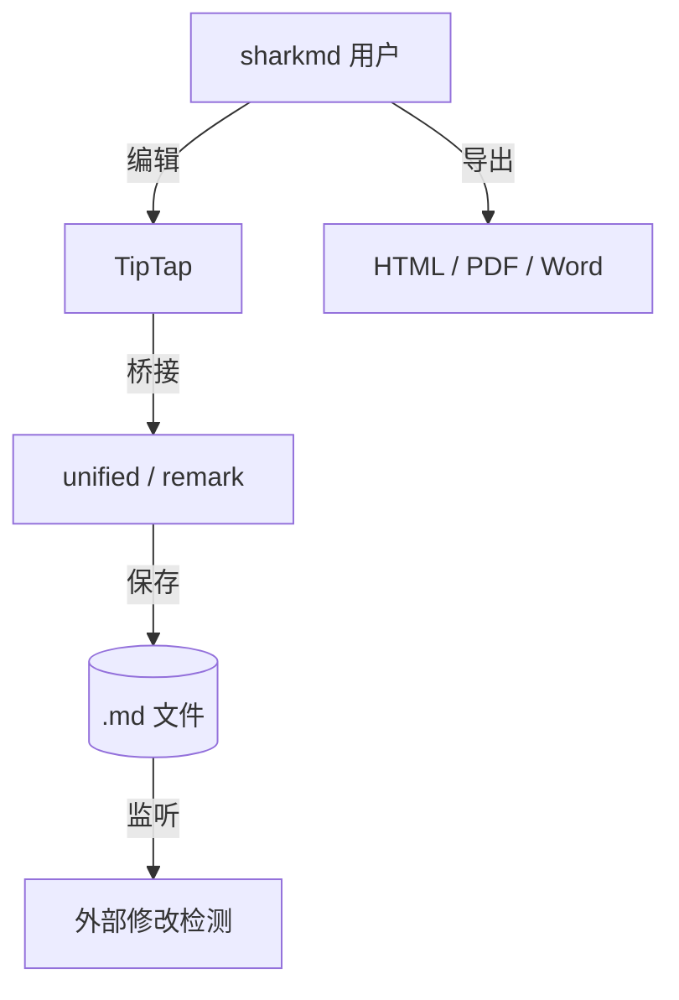

# sharkmd v0.2 功能演示

## GFM 任务列表

- [x] GFM 任务列表
- [ ] 代码语法高亮 (Shiki)
- [ ] 数学公式 (KaTeX)
- [x] 文档导出 (HTML / PDF / Word)
- [x] 查找替换 (正则 / 大小写)
- [x] 多光标 (Ctrl+D)
- [x] 图片管理面板

## KaTeX 数学公式（实时渲染）

行内公式 $E = mc^2$ 与质能方程。

块级公式：

$$
\int_{-\infty}^{\infty} e^{-x^2}\,dx = \sqrt{\pi}
$$

二次公式 $ax^2 + bx + c = 0$ 的解是：

$$
x = \frac{-b \pm \sqrt{b^2 - 4ac}}{2a}
$$

## Mermaid 图表（实时渲染）



## Shiki 代码高亮

```typescript
import { createHighlighter } from 'shiki';

async function highlight(code: string, lang: string) {
  const hl = await createHighlighter({ themes: ['github-dark'], langs: [lang] });
  return hl.codeToHtml(code, { lang, theme: 'github-dark' });
}
```

```python
def fibonacci(n: int) -> int:
    if n < 2:
        return n
    a, b = 0, 1
    for _ in range(n - 1):
        a, b = b, a + b
    return b
```

## 表格

| 阶段         | 状态 | 关键能力           |
| ---------- | -- | -------------- |
| v0.1 (MVP) | ✅  | 基础编辑           |
| v0.2       | ✅  | 实时数学/图表/高亮/导出  |
| v1.0       | 🔜 | 插件 + 同步 + 主题商店 |
